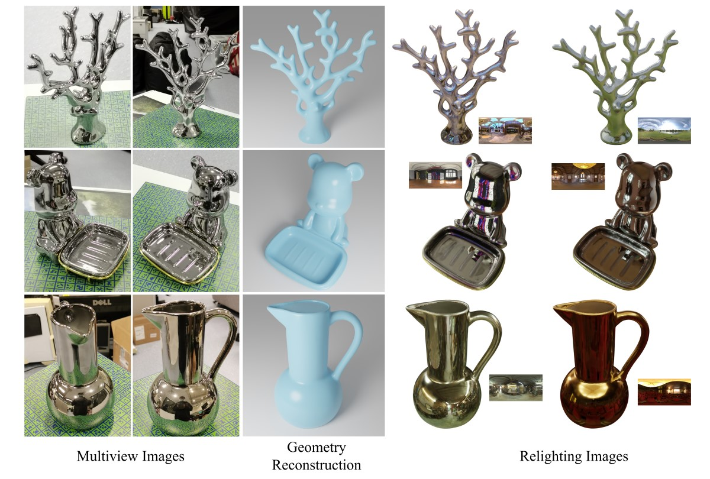

# RotatedMVPS

**Multi-view Photometric Stereo with Rotated Natural Light**

在自然光照与旋转采集条件下，从多视角图像联合恢复物体几何与反射属性的研究与实验代码。

**论文：** IEEE ICME 2025（已录用）· [arXiv:2508.04366](https://arxiv.org/abs/2508.04366)



---

## 仓库结构

| 目录 | 说明 |
|------|------|
| `configs/` | 训练、实验与数据配置 |
| `dataset/` | 数据库类型与样本构建 |
| `network/` | 体渲染、场网络与损失相关模块 |
| `train/` | 训练循环、学习率与验证 |
| `utils/` | 通用工具与数据读写 |
| `colmap/` | COLMAP 相关脚本 |
| `blender_backend/` | 与 Blender 配合的重光照等 |
| `raytracing/` | 光线追踪扩展（需按环境编译） |
| `assets/` | 图示资源 |

入口脚本包括：`run_training.py`（训练）、`extract_mesh.py` / `extract_materials.py`（导出）、`relight.py`（重光照）、`run_colmap.py`（位姿与稀疏重建）等。

---

## 文档

- [自定义物体数据准备与流程](custom_object.md)  
- [形状评测（Chamfer 等）](eval.md)

---

## 使用说明

依赖 CUDA 与若干图形学相关扩展，需按本机环境安装 Python 包与第三方库（如可微光栅化、光线追踪扩展等）。数据目录与配置项以 `configs/` 内 yaml 为准。

为控制仓库体积，**tiny-cuda-nn** 未纳入版本库；克隆后请在项目根目录旁自行获取 [NVlabs/tiny-cuda-nn](https://github.com/NVlabs/tiny-cuda-nn) 并编译，或按所用基线代码的说明放置到预期路径。

---

## 引用

```bibtex
@inproceedings{yang2025rotatedmvps,
  title     = {RotatedMVPS: Multi-view Photometric Stereo with Rotated Natural Light},
  author    = {Yang, Songyun and Han, Yufei and Zhang, Jilong and Liang, Kongming and Yu, Peng and Qu, Zhaowei and Guo, Heng},
  booktitle = {Proc. {IEEE} Int. Conf. Multimedia and Expo (ICME)},
  year      = {2025},
  address   = {Nantes, France},
  note      = {arXiv:2508.04366}
}
```

---

## 致谢

本仓库在公开可用的神经隐式表面 / 逆渲染实现基础上改进与扩展；其中几何与材质管线受益于社区已有工作，向相关开源作者致谢。
